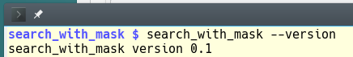
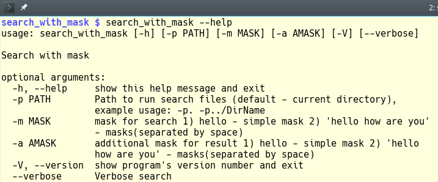
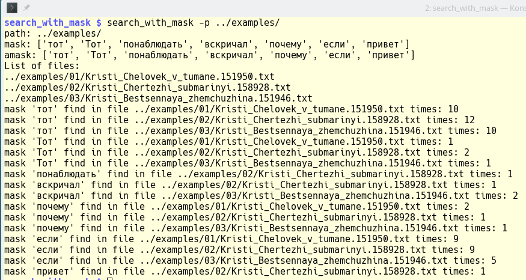
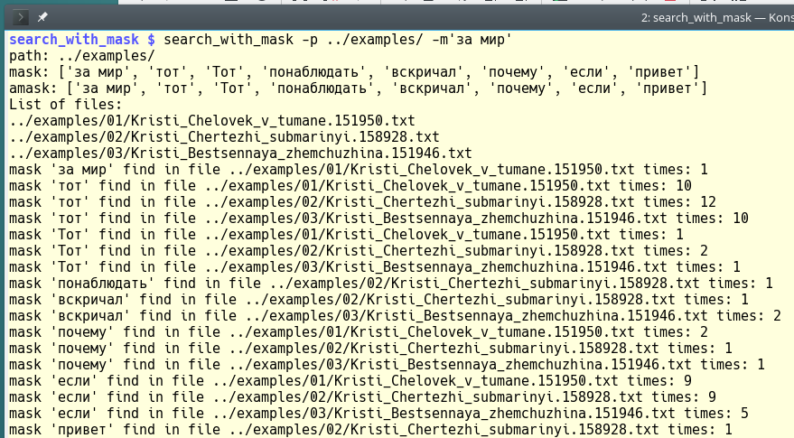
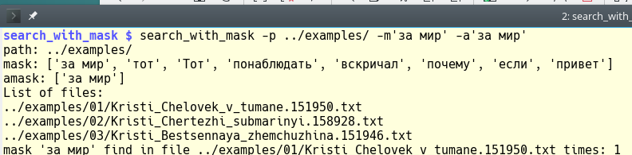

# Задание

1. искать в задаваемой папке
2. искать в файлах *.txt
3. искать только в папках начинающихся с 00-99
4. файл масок Keys.txt для хранения и записи масок. одна строка - одно слово
5. писать список найденного в файл индекса index.log
6. выводить индекс или поиск по индексу

# Описание решения

1. для решения был выбран язык программирования *Python*
2. для создания приложения - собирается *Python* пакет
3. исходные коды и установочный файл пакета помещаются на [GitHub](https://github.com/taniy935/search_with_mask)
   в месте с заданием, помещен файл описания, примеры для поиска, screenshot работающей программы

## Состав

### Исходный код

+ . (корень)
  - README.md - файл описания программы
  - MANIFEST.in - файл пакета Python
  - Makefile - make-file для сборки пакета из исходного кода и установки пакета
  - setup.py - установочный файл пакета Python

+ ./search_with_mask/
  - search_with_mask.py - исходный код программы реализующий алгоритм поиска и Python пакета
  __init__.py - содержит версию программы(для Python пакета)

### Прочее
+ ./demo/demo.mkv - screen-cast работы программы
+ ./images/ - screenshot работающей программы
+ ./examples/ - файлы для поиска, используются для отладки программы.
+ ./dist/search_with_mask-0.1.tar.gz - установочный файл пакета(собранный при помощи Makefile)

# Результат

## Примеры работы

использование только файла масок

использование файла масок и масок из консоли

использование файла масок и масок из консоли и дополнительных масок

